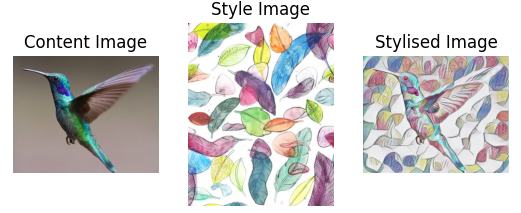



<figure>
  
</figure>



## About
Neural style transfer is an optimization technique used to take two images — a content image and a style reference image (such as an artwork by a famous painter) and blend them together so the output image looks like the content image, but “painted” in the style of the style reference image.



<figure>
  
</figure>



The frontend application was built using React, allowing the user to upload their content image and choose the style images.



<figure>
  
</figure>



## How it works?

### Convolutional neural networks and feature representation



<figure>
  
</figure>



The deep learning model used in this project is a convolutional neural network (CNN) called VGG-19 which was trained on more than a million images from the ImageNet database. AS such, the network is able to detect many features in an image. The shallow layers capture simple patterns like straight line and edges while deep layers capture more complex features such as a face of a person or a wheel of a car. This is how features are representede in the CNN.

We first randomly generate a noisy image which is going to be our output image (O). We then calculate how similar is this image to the content of the provided content image (C) and the style of the provided style image (S) at a particular layer in the network. We can then maximise these two values in order to generate O that has the content of C and the style of S.

### Content Loss
In the content loss, the features of the generated image are compared to the content image. It is to make sure that the generated image has the same content while the algorithm changes the style. This way, the authenticity of the content image isn’t lost and from the style image, the style elements get added.

The mean-squared-error (MSE) between the content features of O and C is used to quantitatively measure how similar the contents are.

### Style Loss
Style loss calculates how different the styles of O and S are. We use gram matrices to quantitatively describe the style of an image. The Gram matrix encodes the feature distributions as the correlation between different features, and not simply the presence of specific features. The matrix measures covariance and therefore it captures information about regions of the image which tend to activate together. The benefit of using a gram matrix is that it enables different features to co-exist in different parts of the images.

The style loss is then calculated as the normalized, squared difference in Gram matrices between O and S.

### Total Loss
Total loss is simply the sum of the content loss and the style loss. Once the total loss is calculated, we can minimise it using backpropagation algorithm, turning the randomly generated noisy image into a meaningful piece of art.

