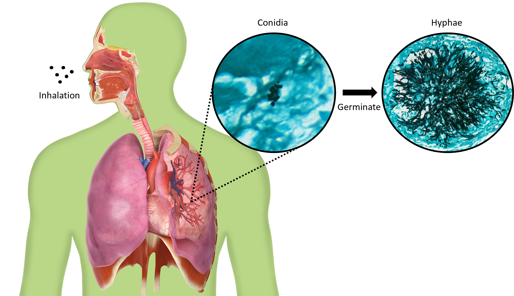

This project was completed and submitted as part of the requirements for my master of engineering degree at Imperial College London. I worked as part of the [Biological Control Systems Lab](https://rtanaka.bg-research.cc.ic.ac.uk/) and was supervised by [Dr. Reiko Tanaka](https://www.imperial.ac.uk/people/r.tanaka) and [Dr. Rahman Attar](https://scholar.google.com/citations?hl=en&user=-R7aRpQAAAAJ&view_op=list_works&sortby=pubdate).

# Introduction #

## Aspergillus fumigatus and invasive aspergillosis ##
Aspergillus fumigatus (A. fumigatus) is a ubiquitous fungus that humans are exposed to everyday. A. fumigatus reproduces asexually by releasing conidia, a type of asexual spores that
germinates into hyphae, into the atmosphere. These airborne conidia have a sufficiently small
diameter of 2-3 μm to reach the lung alveoli and humans inhale several hundred conidia per
day.

Inhalation of conidia can cause various illnesses depending on the immune status of the host.
In immunocompetent individuals, there is rarely any adverse effect since the conidia are efficiently
neutralised and eliminated by the immune system. However, in immunocompromised patients,
it can cause life-threatening invasive aspergillosis (IA) where the conidia germinates into hyphae
that invade the lungs and can spread rapidly to other parts of the body such as brain, heart and
kidneys which can result in death.

## Quantification of fungal burden ##
Quantifying fungal burden is important for tracking the disease progression and evaluating the effectiveness of the novel therapeutics. However, enumeration of fungal burden and extent of tissue invasion in histology images is still done manually, which is a tedious and time-consuming task and prone to error.