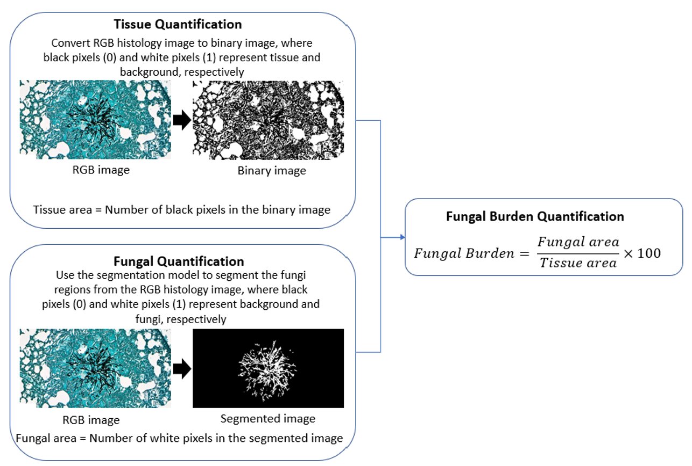
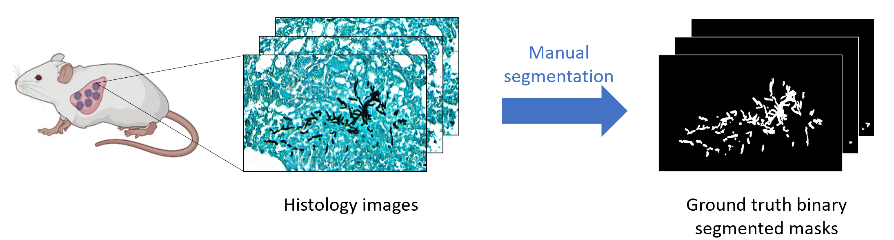
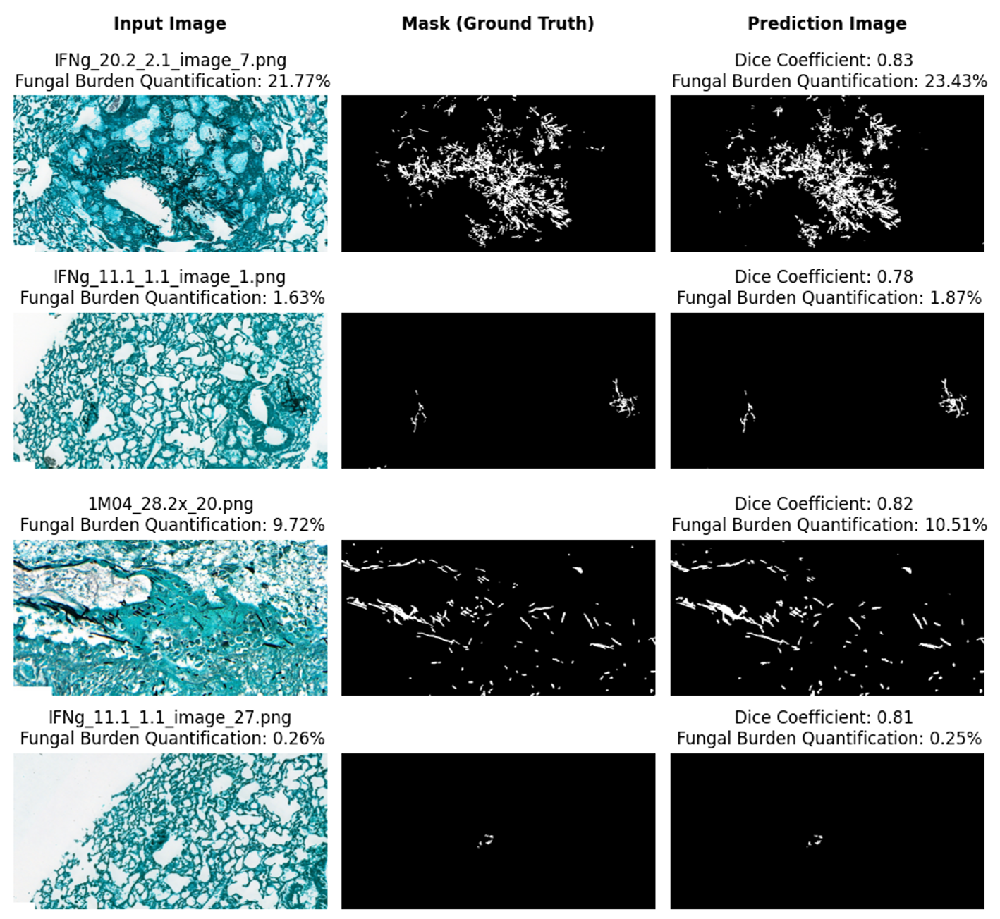

This project was completed, awarded First Class Honours and submitted as part of the requirements for my master of engineering degree at Imperial College London. I worked as part of the [Biological Control Systems Lab](https://rtanaka.bg-research.cc.ic.ac.uk/) and was supervised by [Dr. Reiko Tanaka](https://www.imperial.ac.uk/people/r.tanaka) and [Dr. Rahman Attar](https://scholar.google.com/citations?hl=en&user=-R7aRpQAAAAJ&view_op=list_works&sortby=pubdate).

# Aspergillus fumigatus and invasive aspergillosis #
Aspergillus fumigatus (A. fumigatus) is a ubiquitous fungus that humans are exposed to everyday. A. fumigatus reproduces asexually by releasing conidia, a type of asexual spores that
germinates into hyphae, into the atmosphere. These airborne conidia have a sufficiently small
diameter of 2-3 μm to reach the lung alveoli and humans inhale several hundred conidia per
day.

Inhalation of conidia can cause various illnesses depending on the immune status of the host.
In immunocompetent individuals, there is rarely any adverse effect since the conidia are efficiently
neutralised and eliminated by the immune system. However, in immunocompromised patients,
it can cause life-threatening invasive aspergillosis (IA) where the conidia germinates into hyphae
that invade the lungs and can spread rapidly to other parts of the body such as brain, heart and
kidneys which can result in death.



<figure>
  
  <figcaption style='text-align:center;'>Figure 1: Inhalation of conidia resulting in the germination of hyphae in immunocompromised patients
</figcaption>
</figure>



# Quantification of fungal burden #
Quantifying fungal burden is important for tracking the disease progression and evaluating the effectiveness of the novel therapeutics. However, enumeration of fungal burden and extent of tissue invasion in histology images is still done manually, which is a tedious and time-consuming task and prone to error.

To quantify the fungal burden, we first calculate the tissue area by converting the histology image into a binary image through a thresholding technique and counting the number of black pixels which correspond to the tissue pixels. Next, the fungal area is calculated by using a convolutional neural network to segment the fungi region from the histology image and counting the number of white pixels in it as they correspond to the fungi pixels. Finally, the fungal buden is calculated by dividing the fungal area by the tissue area.



<figure>
  
  <figcaption style='text-align:center;'>Figure 2: Quantification of fungal burden
</figcaption>
</figure>



# Dataset #
Dataset consisted of 149 512-by-1024 pixels GMS stained patch-level histology images of murine lung infected with A. fumigatus and their corresponding pathologist-verified ground truth binary segmented masks



<figure>
  
  <figcaption style='text-align:center;'>Figure 5: The process of collecting the dataset 
</figcaption>
</figure>



# Semantic image segnmentation and convolutional neural network #
Semantic image segmentation classifies every pixel of an image with a class label. In our application,
this means labelling each pixel in the histology images as fungi or non-fungi. Convolutional neural
network (CNN) is a deep learning architecture inspired by the natural visual perception mechanism. CNN learns important features in images in order to perform prediction, classification and
segmentation tasks. CNN has been widely used in multiple biomedical image analysis tasks. In histology images, CNN has been used to segment out certain tissue types such as
leukocytes, lymphocytes and erythocytes, showing great promise in quantifying the fungal burden.

CNN architectures for semantic segmentation usually incorporate encoder and decoder networks.
The encoder network reduces the size of an image to capture important details of the image. This
allows the model to learn important features of the image, however, it loses the spatial information.
The decoder network restores back the resolution of the image, allowing the learned features to be
localised and used to construct the segmented image.

In this project, we explored 4 popular segmentation network architectures FCN, U-Net, SegNet and PSPNet, and 2 different pre-trained model backbones VGG16 and ResNet50. We found that VGG U-Net model gave the highest mean DICE score when evaluated using 5-fold cross-validation.



<figure>
  
  <figcaption style='text-align:center;'>Figure 3: Architecture of U-Net (Ronneberger et al., 2015)
</figcaption>
</figure>

<figure>
  
  <figcaption style='text-align:center;'>Figure 4: Architecture of VGG-16 
(Simonyan & Zisserman, 2015)
</figcaption>
</figure>



# Data augmentation #

Deep learning techniques relies heavily on large datasets to allow the model to generalise and
avoid overfitting as the model is exposed to more training examples. However, for biomedical images
such as histology images, collecting and labelling data can be a very laborious task. Data augmentation is a technique of artificially expanding the size and variety of the dataset by applying image
transformations on the existing dataset. For this project, we used both geometric and colour transformation. For each input original image, 10 augmented images were generated, inflating the training set by 10 times.

# Results #
The VGG U-Net achieved the mean DICE score of 0.74±0.03. Figure 6 shows sample plots of the segmentation predicted as well as the predicted fungal burden quantification.



<figure>
  
  <figcaption style='text-align:center;'>Figure 6: Sample plot of the segmentation and the fungal burden quantification
</figcaption>
</figure>



# Full report #
The full report is available in the PDF format below



<embed src="files/final_report.pdf" width="70%" height="800px" 
 type="application/pdf">

 